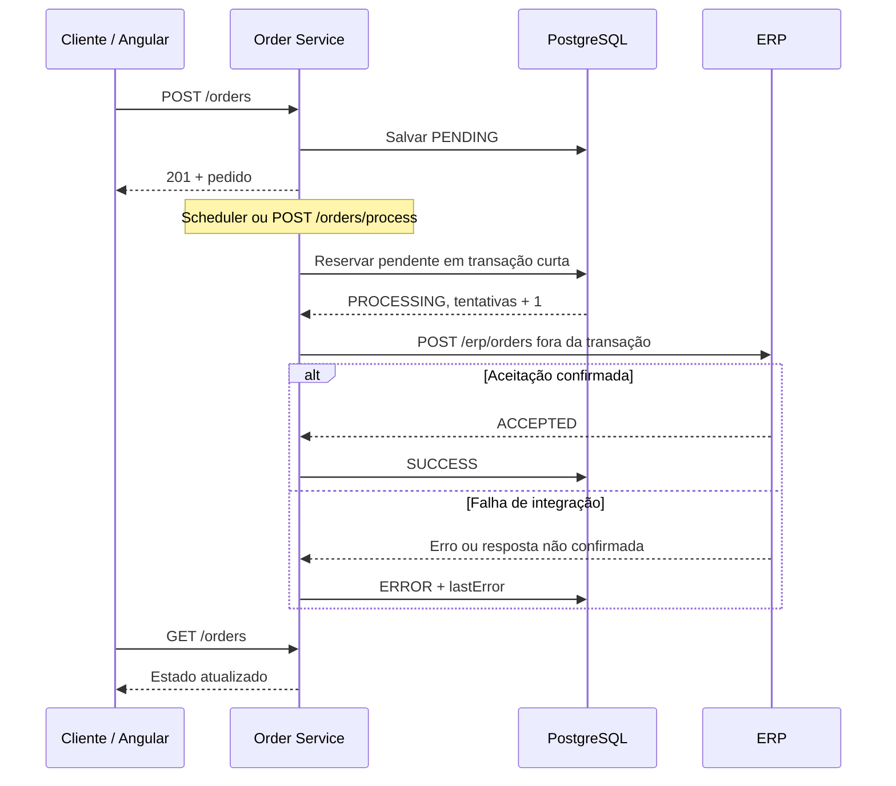

# Pedidos Integrados

Aplicação demonstrativa de integração de pedidos: um frontend Angular cadastra pedidos em uma API Java/Spring Boot, que persiste os dados no PostgreSQL e envia os pedidos para um simulador de ERP por HTTP.

## Documentação

O contrato utiliza o padrão [OpenAPI 3.0.3](https://spec.openapis.org/oas/v3.0.3.html). O guia abaixo apresenta um tutorial de uso; a referência detalha as regras e os erros.

- [Referência completa dos endpoints](docs/API.md)
- [Contrato OpenAPI: entradas, respostas, validações e exemplos](docs/openapi.json)
- [Requisições prontas para IntelliJ HTTP Client/REST Client](requests/api.http)
- [Operação e execução local](OPERACAO.txt)

Para visualizar o contrato, importe `docs/openapi.json` no Swagger Editor ou no Postman. As operações do ERP têm servidor próprio na porta 18081; as de pedidos usam 18080 no Docker. A aplicação não inclui uma rota Swagger UI. Chamadas pelo navegador dependem de suas políticas de CORS; os exemplos PowerShell abaixo podem ser executados diretamente no terminal.

## Iniciar o projeto

Requisito: Docker Desktop em execução, com Docker Compose. Execute na raiz do repositório:

```powershell
docker compose up --build -d
docker compose ps
```

Aguarde os serviços ficarem disponíveis. O primeiro build baixa imagens e dependências. Não é necessário instalar Java ou Node no computador para esta forma de execução.

| Componente | Endereço padrão no Docker | Função |
|---|---|---|
| Frontend | http://localhost:8088 | Cadastro, consulta, processamento e reenvio pela interface |
| Order Service | http://localhost:18080 | API de pedidos |
| ERP Service | http://localhost:18081 | Simulação de aceitação externa |
| PostgreSQL | localhost:5434 | Persistência dos pedidos |

Não há autenticação neste projeto demonstrativo. Requisições com corpo usam `Content-Type: application/json`. Valores monetários usam ponto decimal. Datas seguem ISO 8601 com fuso horário.

## Tutorial: cadastrar, processar e consultar

Execute os exemplos no **PowerShell**, na ordem apresentada. Os identificadores são gerados a cada execução para evitar conflitos com pedidos anteriores. Os exemplos criam dados que permanecem no banco.

### 1. Criar um pedido

```powershell
$api = 'http://localhost:18080'
$erp = 'http://localhost:18081'
$referencia = 'DEMO-' + [guid]::NewGuid().ToString('N')
$dados = @{
    externalId = $referencia
    customerName = 'Cliente de teste'
    totalValue = 125.50
}
$pedido = Invoke-RestMethod -Method Post -Uri "$api/orders" `
    -ContentType 'application/json' -Body ($dados | ConvertTo-Json)
$pedido
```

**Resposta: HTTP 201 Created.** Exemplo ilustrativo:

```json
{
  "id": 1,
  "externalId": "DEMO-001",
  "customerName": "Cliente de teste",
  "totalValue": 125.50,
  "status": "PENDING",
  "attemptCount": 0,
  "lastError": null,
  "createdAt": "2026-09-21T12:00:00Z",
  "updatedAt": "2026-09-21T12:00:00Z",
  "version": 0
}
```

O cadastro salva o pedido; o envio ao ERP ocorre no processamento. `externalId` identifica o pedido no sistema externo e deve ser único. `id` é o identificador interno usado na URL de reenvio. Repetir o cadastro com o mesmo `externalId` retorna **409**, mesmo com os mesmos dados.

### 2. Processar o lote

```powershell
Invoke-RestMethod -Method Post -Uri "$api/orders/process"
```

Não envie corpo. Exemplo de resposta **HTTP 200**:

```json
{"processed":1,"succeeded":1,"failed":0}
```

A chamada aguarda o lote terminar e processa até 20 pedidos pendentes por padrão, com 4 trabalhadores em paralelo. O lote inclui pendências de outros usuários. O agendador também executa o processamento: se já tiver consumido o pedido, a chamada pode retornar os três contadores zerados. Consulte a lista para saber o resultado de cada pedido.

### 3. Consultar o resultado

```powershell
$lista = Invoke-RestMethod -Method Get -Uri "$api/orders"
$lista | Where-Object { $_.id -eq $pedido.id }
```

**HTTP 200:** a API retorna um array ordenado do cadastro mais recente para o mais antigo; sem pedidos, retorna `[]`. O filtro acima é feito no PowerShell. Não existe endpoint `GET /orders/{id}`, paginação ou filtro de consulta implementado.

Após integração confirmada, o status será `SUCCESS`. Uma falha de integração fica em `ERROR`, com descrição em `lastError`. A falha de um pedido pode coexistir com uma resposta **200** do processamento: o resultado aparece em `failed`. Falhas inesperadas de infraestrutura podem causar **500**.

## Tutorial: simular falha e reenviar

Este exemplo pressupõe as configurações padrão do simulador. O prefixo `FAIL-` no **externalId** provoca erro antes da aceitação pelo ERP.

```powershell
$falha = @{
    externalId = 'FAIL-' + [guid]::NewGuid().ToString('N')
    customerName = 'Cliente de teste'
    totalValue = 50.00
}
$pedidoComFalha = Invoke-RestMethod -Method Post -Uri "$api/orders" `
    -ContentType 'application/json' -Body ($falha | ConvertTo-Json)
Invoke-RestMethod -Method Post -Uri "$api/orders/process"
$atual = @(Invoke-RestMethod -Uri "$api/orders") |
    Where-Object { $_.id -eq $pedidoComFalha.id }
$atual
```

Só prossiga quando esse pedido estiver em `ERROR`. Se havia muitas pendências, ele pode precisar de outro lote; se estiver em `PROCESSING`, aguarde e consulte novamente.

Antes de um reenvio real, confira no ERP que o pedido não foi integrado. **Timeout não significa que o ERP deixou de executar a operação.** O simulador não oferece endpoint de consulta de aceitações; a confirmação em um sistema real exige consulta ao ERP ou reconciliação operacional. No cenário controlado acima, a falha pelo prefixo ocorre antes da aceitação.

```powershell
if ($atual.status -ne 'ERROR') {
    throw 'Consulte novamente e prossiga somente com o pedido em ERROR.'
}
$reenvio = @{
    order = @{
        externalId = 'CORRIGIDO-' + [guid]::NewGuid().ToString('N')
        customerName = $atual.customerName
        totalValue = $atual.totalValue
    }
    version = $atual.version
    confirmedNotIntegrated = $true
}
$reenfileirado = Invoke-RestMethod -Method Post -Uri "$api/orders/$($atual.id)/retry" `
    -ContentType 'application/json' -Body ($reenvio | ConvertTo-Json -Depth 3)
$reenfileirado
Invoke-RestMethod -Method Post -Uri "$api/orders/process"
Invoke-RestMethod -Uri "$api/orders" |
    Where-Object { $_.id -eq $atual.id }
```

O retry retorna **200** com status `PENDING`; não envia imediatamente ao ERP. Preserva o ID, a criação, a quantidade de tentativas e o último erro. A próxima reserva incrementa `attemptCount` e limpa `lastError`. A versão precisa ser a da consulta mais recente; versão desatualizada ou status diferente de `ERROR` retorna **409**. Pedido inexistente retorna **404**; corpo inválido ou confirmação ausente/falsa retorna **400**.

## Endpoints disponíveis

| Serviço | Método e caminho | Corpo | Sucesso | Erros tratados |
|---|---|---|---|---|
| Pedidos | `POST /orders` | Dados do pedido | 201, pedido | 400, 409 |
| Pedidos | `GET /orders` | Nenhum | 200, array de pedidos | — |
| Pedidos | `POST /orders/process` | Nenhum | 200, resumo do lote | — |
| Pedidos | `POST /orders/{id}/retry` | `order`, `version`, `confirmedNotIntegrated` | 200, pedido pendente | 400, 404, 409 |
| ERP | `GET /health` | Nenhum | 200, `{"status":"UP"}` | — |
| ERP | `POST /erp/orders` | Dados do pedido | 200, aceitação | 400, 409, 500 |

Falhas não tratadas podem retornar outros erros HTTP. Consulte os formatos completos em [Referência da API](docs/API.md).

### Validar e chamar o ERP diretamente

```powershell
Invoke-RestMethod -Uri "$erp/health"
$entradaErp = @{
    externalId = 'ERP-' + [guid]::NewGuid().ToString('N')
    customerName = 'Cliente direto'
    totalValue = 25.00
}
Invoke-RestMethod -Method Post -Uri "$erp/erp/orders" `
    -ContentType 'application/json' -Body ($entradaErp | ConvertTo-Json)
```

Resposta de aceitação:

```json
{"externalId":"ERP-DEMO-001","status":"ACCEPTED","processedAt":"2026-09-21T12:00:00Z"}
```

Essa chamada não cadastra um pedido no Order Service. Repetir a mesma entrada no ERP retorna a aceitação anterior, incluindo a data. Usar o mesmo identificador com outro cliente ou valor retorna **409**. Esse controle existe somente em memória e é perdido ao reiniciar o ERP.

## Como a integração funciona



O fluxo de estados é `PENDING → PROCESSING → SUCCESS` ou `ERROR`. O retry autorizado faz `ERROR → PENDING`.

O `OrderController` recebe cadastro, consulta e reenvio. O `OrderService` valida as regras de negócio e persiste os pedidos. O `OrderProcessor`, chamado manualmente ou pelo agendador, distribui o lote no executor. O `OrderProcessingTransactions` reserva e finaliza cada pedido em transações curtas; o `HttpErpClient` realiza a integração HTTP fora dessas transações.

A reserva usa `FOR UPDATE SKIP LOCKED`, escolhendo os pendentes mais antigos e pulando registros bloqueados por outro processamento. As migrações Flyway criam e evoluem o banco. `version` protege o reenvio contra dados desatualizados.

O agendador e a API ficam no mesmo serviço; não há broker ou worker independente. Uma queda depois da reserva pode deixar o pedido em `PROCESSING`, exigindo reconciliação. Não há recuperação automática desse estado, reenvio automático de `ERROR` ou garantia de execução exatamente uma vez entre serviços.

## Configuração

| Variável | Padrão | Efeito |
|---|---|---|
| `ORDER_PROCESSING_BATCH_SIZE` | 20 | Tarefas por lote, de 1 a 100 |
| `ORDER_PROCESSING_WORKERS` | 4 | Trabalhadores, de 1 a 16 |
| `ORDER_PROCESSING_SCHEDULING_ENABLED` | `true` no Compose; `false` local | Ativa o agendador |
| `ORDER_PROCESSING_FIXED_DELAY` | 60000 | Intervalo em ms após o fim de cada execução agendada |
| `ORDER_PROCESSING_INITIAL_DELAY` | 60000 | Atraso inicial em ms |
| `ERP_CONNECT_TIMEOUT` | `2s` | Limite de conexão ao ERP |
| `ERP_READ_TIMEOUT` | `3s` | Limite de espera pela resposta |
| `ERP_MINIMUM_DELAY_MS` / `ERP_MAXIMUM_DELAY_MS` | 500 / 2000 | Atraso simulado |
| `ERP_FAILURE_PREFIX` | `FAIL-` | Prefixo de falha simulada |
| `ERP_RANDOM_FAILURE_RATE` | 0.0 | Probabilidade de falha aleatória |
| `FRONTEND_PORT` / `ORDER_HTTP_PORT` / `ERP_HTTP_PORT` | 8088 / 18080 / 18081 | Portas publicadas pelo Compose |

`DB_URL`, `DB_USERNAME`, `DB_PASSWORD` e `ERP_BASE_URL` configuram a execução local. O Compose define esses valores com os nomes dos serviços da rede Docker; altere o Compose se precisar mudar esses destinos no container.

Para uma demonstração apenas com processamento manual, execute antes de iniciar os containers:

```powershell
$env:ORDER_PROCESSING_SCHEDULING_ENABLED = 'false'
docker compose up --build -d
```

Para debug remoto:

```powershell
docker compose -f compose.yaml -f compose.debug.yaml up --build -d
```

O override desliga o agendador, amplia o timeout de leitura do ERP para 300 segundos e expõe as portas de debug definidas em `compose.debug.yaml`. Evite breakpoints durante testes de envio.

## Testes e operação

```powershell
# Logs
docker compose logs -f order-service erp-service

# Parar preservando o volume do banco
docker compose down

# Testes Java: requer Java 17 e Maven 3.9
mvn test

# Inclui concorrência em PostgreSQL real: requer Docker disponível
mvn verify -Pintegration-tests

# Smoke HTTP: requer serviços iniciados e ambiente sem pedidos pendentes/em processamento
powershell -ExecutionPolicy Bypass -File scripts/test-api.ps1
```

O smoke cria pedidos sintéticos e os mantém no banco; use um ambiente de teste sem operações concorrentes. O build Docker não executa testes. Para o frontend, execute `npm ci`, `npm test -- --watch=false` e `npm run build` dentro de `frontend` com o ambiente Node compatível com o projeto.

Não use `docker compose down -v` para preservar os dados. Após alterar código, reconstrua as imagens com `docker compose up --build -d`.

## Manter a documentação

Ao alterar um controller, DTO, validação ou resposta de erro, atualize [o contrato](docs/openapi.json), [a referência](docs/API.md) e os exemplos afetados. A especificação é mantida no repositório; não é gerada automaticamente pelo Spring. `API.txt` disponibiliza uma versão de consulta em texto simples.
